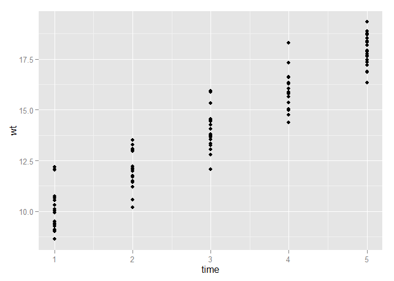
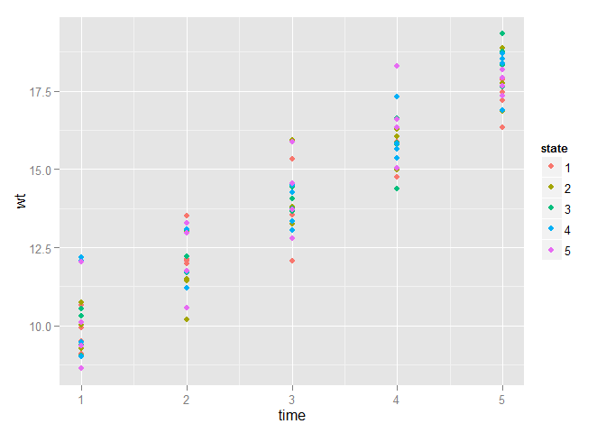
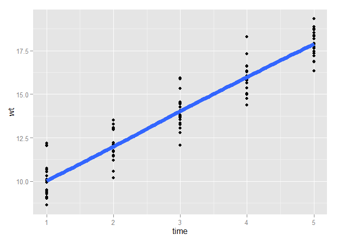
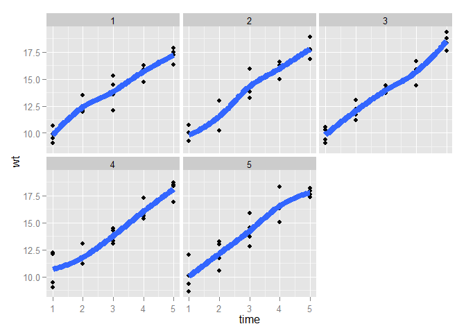

# hello world
Prasanna Samuel, P  
Monday, May 25, 2015  

Simulating a data-set (longitudinal) using rnorm


```
## 'data.frame':	100 obs. of  4 variables:
##  $ wt   : num  9.51 13.51 15.32 14.75 17.85 ...
##  $ time : int  1 2 3 4 5 1 2 3 4 5 ...
##  $ state: Factor w/ 5 levels "1","2","3","4",..: 1 1 1 1 1 1 1 1 1 1 ...
##  $ id   : int  1 1 1 1 1 2 2 2 2 2 ...
```
---
Scatter-plot

 
---
Adding state-wise along with smoothers

 

```
## geom_smooth: method="auto" and size of largest group is <1000, so using loess. Use 'method = x' to change the smoothing method.
```

 

```
## geom_smooth: method="auto" and size of largest group is <1000, so using loess. Use 'method = x' to change the smoothing method.
## geom_smooth: method="auto" and size of largest group is <1000, so using loess. Use 'method = x' to change the smoothing method.
## geom_smooth: method="auto" and size of largest group is <1000, so using loess. Use 'method = x' to change the smoothing method.
## geom_smooth: method="auto" and size of largest group is <1000, so using loess. Use 'method = x' to change the smoothing method.
## geom_smooth: method="auto" and size of largest group is <1000, so using loess. Use 'method = x' to change the smoothing method.
```

 

---
